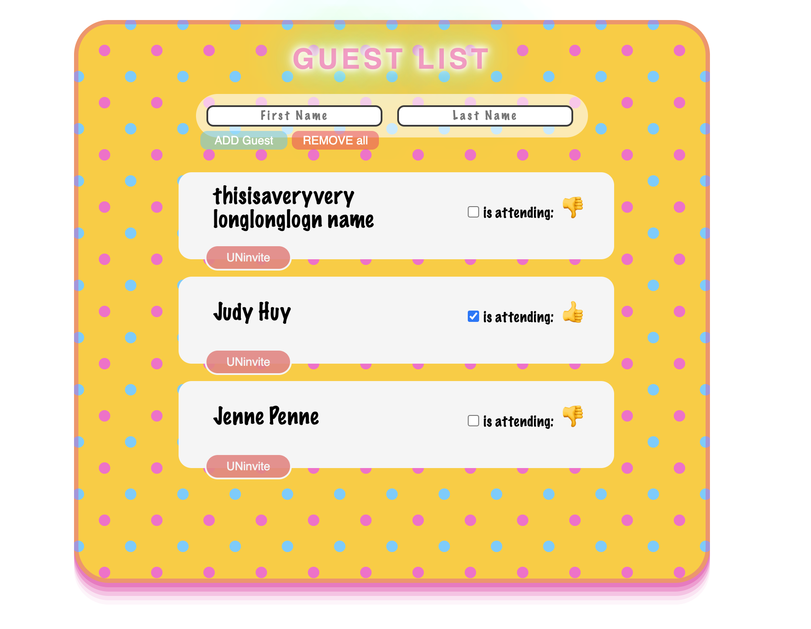

## ▶ Description

A simple but colorful `guest list`!

## ▶ Functionalities

- `First name` and `Last name` input
- `ADD guest` button, adds guest to guest list
- `Remove all` button, removes everyone
- list with all names
- checkbox is attending / not
- `UNinvite` button, removes selected guest

## ▶ Technologies

- React
- API

## ▶ Setup instructions

- Clone the repository with `git clone <repo>`
- Set up API <a href="https://github.com/upleveled/express-guest-list-api-memory-data-store">here</a>
- yarn start

---

